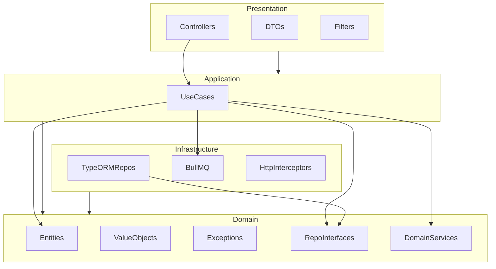

# Plano de Implementação — API Workflow InCicle

Este plano segue a **ORDEM DE DESENVOLVIMENTO** definida em [plano.md](plano.md) (etapas 1–18), alinhado aos requisitos do desafio em [message.txt](message.txt).

---

## Etapa 1 — Setup do projeto

### 1.1 Instalação do ambiente (Fedora, máquina sem ferramentas)

Considerar que **não há Node.js, Docker, Git nem k6** instalados. Em Fedora atualizado, instalar na seguinte ordem:

- **Git** (para clonar/versionar e para o NestJS CLI em alguns fluxos):
  - `sudo dnf install -y git`
- **Node.js 20 LTS** (recomendado para NestJS):
  - Opção A — repositório NodeSource: seguir [nodesource.com](https://github.com/nodesource/distributions) para Fedora (Node 20.x).
  - Opção B — dnf: `sudo dnf install -y nodejs` (versão do repositório Fedora; checar com `node -v` — idealmente 18+).
- **npm** (geralmente vem com Node): `sudo dnf install -y npm` se necessário.
- **Docker Engine + Docker Compose** (obrigatório para rodar e validar o desafio):
  - Habilitar repositório: `sudo dnf -y install dnf-plugins-core && sudo dnf config-manager --add-repo https://download.docker.com/linux/fedora/docker-ce.repo`
  - Instalar: `sudo dnf install -y docker-ce docker-ce-cli containerd.io docker-compose-plugin`
  - Iniciar e habilitar: `sudo systemctl enable --now docker`; adicionar usuário ao grupo: `sudo usermod -aG docker $USER` (fazer logout/login ou `newgrp docker`).
  - Verificar: `docker --version` e `docker compose version`.
- **k6** (para etapa 15 — testes de carga): `sudo dnf install -y k6` ou seguir [k6 docs](https://grafana.com/docs/k6/latest/set-up/install-k6/) para Fedora.

Documentar no README os comandos de instalação usados (Fedora) para o avaliador reproduzir em ambiente limpo.

### 1.2 Projeto NestJS e estrutura

- Criar projeto NestJS (TypeScript), configurar TypeORM para PostgreSQL 15 e BullMQ com Redis 7.
- Estrutura base: `src/` com subpastas `domain/`, `application/`, `infrastructure/`, `presentation/`; `test/unit/`, `test/integration/`, `test/e2e/`; `load-tests/`.
- Adicionar `docker-compose.yml` com serviços `api`, `postgres:15` e `redis:7`, healthchecks e `depends_on` com `condition: service_healthy`.
- Criar [.env.example](.env.example) com: `APP_PORT`, `DB_`*, `ASYNC_PROVIDER=bullmq`, `ASYNC_URL`, `LOG_LEVEL`, `SLA_DEFAULT_HOURS`.
- Configurar script de boot para rodar migrations antes de aceitar requisições.
- Dependências: `class-validator`, `class-transformer`, `@nestjs/terminus`, `ioredis`, `@nestjs/bullmq`, `bullmq`, `typeorm`, `pg`.

**Entregável:** Ambiente Fedora reproduzível (comandos no README); projeto sobe com `docker compose up`, migrations executam, API responde.

---

## Etapa 2 — Domínio puro

- **Entidades** em `src/domain/entities/`: classes TypeScript puras, sem decorators TypeORM: `template`, `template-version`, `workflow-instance`, `instance-step`, `step-vote`, `delegation`, `org-chart-member`, `audit-log`.
- **Value objects** em `src/domain/value-objects/`: `ApprovalRule` (ALL | ANY | QUORUM), `SlaConfig`, `Snapshot` (4 campos: template_version, resolved_flow, resolved_approvers, org_context), `CompanyId`.
- **Exceções** em `src/domain/exceptions/`: `DelegationCycleException`, `DelegationExpiredException`, `StepAlreadyResolvedException`, `VersionNotPublishedException`, `DuplicateVoteException`.
- **Interfaces de repositório** em `src/domain/repositories/`: `TemplateRepository`, `TemplateVersionRepository`, `InstanceRepository`, `StepRepository`, `DelegationRepository`, `OrgChartRepository`, `AuditRepository`.
- **Domain services** em `src/domain/services/`: `ApprovalRuleService` (ALL/ANY/QUORUM), `DelegationCycleService` (DFS para ciclo), `SlaService` (deadline e estouro).

**Regra:** Domain não importa nada de infrastructure ou presentation.

---

## Etapa 3 — Migrations e seed básico

- Migrations TypeORM em `infrastructure/database/migrations/`, naming `{timestamp}-{NomeDaAction}.ts`.
- Ordem: Companies → OrgChartMembers → Templates → TemplateVersions → WorkflowInstances → InstanceSteps → StepVotes → Delegations → AuditLogs → CreateIndexes (índices do plano.md).
- Seed básico em `infrastructure/database/seeds/seed.ts`: ao menos 1 company, alguns org_chart_members, 1 template com 1 versão publicada para testes manuais/e2e iniciais.

**Entregável:** Migrations sobem em ambiente limpo; seed popula dados mínimos.

---

## Etapa 4 — SharedModule e infraestrutura HTTP global

- **TenantGuard:** valida presença de `X-Company-ID` e `X-User-ID`; retorna 400 se ausente. Registrar como global ou por módulo conforme arquitetura.
- **Tenant context:** REQUEST-scoped provider para propagar `company_id` e `user_id` aos repositórios (todos os acessos filtram por `company_id`).
- **DomainExceptionFilter:** mapeia exceções de domínio para JSON `{ error, message, statusCode }` conforme tabela em plano.md (422/409).
- **ValidationPipe** global: `whitelist: true`, `forbidNonWhitelisted: true`, `transform: true`.
- Versionamento: `enableVersioning({ type: VersioningType.URI })` — todos os endpoints sob `/v1/`.
- Opcional: `IdempotencyInterceptor` para chave baseada em `X-Idempotency-Key` (se usado em approve/reject).

**Entregável:** Nenhum endpoint sem tenant passa; exceções de domínio retornam formato padronizado.

---

## Etapa 5 — TemplatesModule completo

- Use cases em `application/templates/`: CreateTemplate, CreateVersion, PublishVersion, ListTemplates, GetTemplate.
- Controller em `presentation/templates/`: POST/GET `/v1/templates`, POST `/v1/templates/:id/versions`, POST `/v1/templates/:id/versions/:versionId/publish`.
- Implementar repositórios TypeORM em `infrastructure/database/repositories/` para templates e template_versions; mapear entidades de persistência → entidades de domínio.
- DTOs com `class-validator` para criação de template e de versão (definition em JSONB).

**Entregável:** CRUD de templates e versões; publish altera status para `published` e preenche `published_at`.

---

## Etapa 6 — InstancesModule: create e submit com snapshot e SLA

- Use cases: CreateInstance, SubmitInstance, GetInstance, ListInstances, GetTimeline.
- **SubmitInstance:**  
  - Validar versão publicada (senão lançar `VersionNotPublishedException`).  
  - Resolver aprovadores por step via org chart; montar snapshot com os 4 campos obrigatórios (template_version, resolved_flow, resolved_approvers, org_context).  
  - Gravar snapshot em `workflow_instances.snapshot` e criar `instance_steps`.  
  - Enfileirar job BullMQ de SLA por step com `delay: sla_hours * 3600 * 1000` (e `attempts: 3`, backoff exponencial).
- Controller: POST/GET `/v1/instances`, POST `/v1/instances/:id/submit`, GET `/v1/instances/:id`, GET `/v1/instances/:id/timeline`.
- Garantir que snapshot nunca seja alterado após o submit (apenas leitura).

**Entregável:** Submit só com versão publicada; snapshot imutável preenchido; jobs de SLA agendados.

---

## Etapa 7 — ApprovalsModule: approve e reject com transação, lock e idempotência

- Use cases: ApproveStep, RejectStep, GetInbox.
- **Fluxo em transação (TypeORM):**  
  1. Verificar idempotência: existe `step_vote` (step_id, approver_id)? Se sim, commit e retornar sucesso.
  2. `SELECT instance_step FOR UPDATE`.
  3. Se `step.status !== 'pending'`, ignorar graciosamente (convergência), commit e retornar sucesso.
  4. Resolver delegação: se usuário atual é delegado válido do aprovador, aceitar e gravar `delegated_by`.
  5. Inserir `step_vote`; recalcular status do step com `ApprovalRuleService`; atualizar step (e instância se todos resolvidos).
  6. Publicar evento de auditoria na fila (dentro da transação).
- Controller: GET `/v1/approvals/inbox` (paginação, filtro por steps pendentes do usuário + delegados), POST approve/reject.

**Entregável:** Idempotência; lock evita dupla decisão; convergência fora de ordem; delegação considerada.

---

## Etapa 8 — Regras ALL / ANY / QUORUM no ApprovalRuleService

- Implementar no domain service (sem infra):  
  - **ALL:** todos aprovam e nenhum rejeita.  
  - **ANY:** pelo menos um aprova.  
  - **QUORUM:** aprovações >= floor(total/2)+1; rejeição pode tornar quorum impossível → rejected.
- Integrar no fluxo de approve/reject (atualização de status do step e da instância).

**Entregável:** Comportamento correto para as três regras; testes unitários do service.

---

## Etapa 9 — DelegationsModule: create com detecção de ciclo, list e delete

- Use case CreateDelegation: antes de inserir, chamar `DelegationCycleService` (DFS no grafo de delegações ativas + nova aresta). Se ciclo (ex.: A→B→C→A), lançar `DelegationCycleException` (422).
- Use cases: ListDelegations, ListActiveDelegations, DeleteDelegation.
- No fluxo de aprovação: se delegação usada estiver expirada, lançar `DelegationExpiredException` (422).
- Controller: POST/GET `/v1/delegations`, GET `/v1/delegations/active`, DELETE `/v1/delegations/:id`.

**Entregável:** Ciclo bloqueado; delegação expirada rejeitada; list/active/delete funcionando.

---

## Etapa 10 — MessagingModule: processadores SLA e Audit

- Filas BullMQ: SLA, Audit, (opcional) ApprovalEvent. Configuração de resiliência: `attempts: 3`, `backoff: { type: 'exponential', delay: 1000 }`.
- **SlaProcessor:** ao executar, buscar step; se ainda `pending`, marcar `sla_breached = true` e inserir `audit_log` com action `SLA_BREACHED`.
- **AuditProcessor:** consumir eventos (INSTANCE_SUBMITTED, STEP_APPROVED, STEP_REJECTED, STEP_DELEGATED, SLA_BREACHED, DELEGATION_CREATED, DELEGATION_DELETED, JOB_FAILED); apenas `INSERT` em `audit_logs`. Em `onFailed` (após retries), registrar JOB_FAILED com payload do erro.
- Repositório de auditoria: apenas método `create()`; sem update/delete.

**Entregável:** SLA dispara auditoria de estouro; todos os eventos de aprovação/delegação auditados; falhas de job registradas.

---

## Etapa 11 — AnalyticsModule: sla-compliance

- Endpoint GET `/v1/analytics/sla-compliance` com query params opcionais `from` e `to` (ISO 8601).
- Resposta: `total_instances`, `total_steps`, `breached_steps`, `compliance_rate`, `breached_by_step`, `period`. Tudo filtrado por `company_id`.
- Implementar com queries analíticas (TypeORM ou SQL bruto) sobre `workflow_instances` e `instance_steps`.

**Entregável:** Métricas de conformidade de SLA por empresa e período.

---

## Etapa 12 — HealthModule: liveness e readiness

- GET `/health`: liveness — retorna 200 se a aplicação está no ar.
- GET `/health/ready`: readiness com `@nestjs/terminus` — verificar PostgreSQL e Redis; 200 se ambos ok, 503 se algum indisponível.

**Entregável:** Orquestração e load balancers podem usar /health e /health/ready.

---

## Etapa 13 — Testes: unitários, integração e 8 cenários e2e

- **Unitários** (`test/unit/`): ApprovalRuleService (ALL, ANY, QUORUM), DelegationCycleService (ciclo direto, indireto, sem ciclo), SlaService, Snapshot VO (4 campos e imutabilidade).
- **Integração** (`test/integration/`): repositórios com PostgreSQL de teste; filtro por `company_id`; constraint UNIQUE(step_id, approver_id) ao inserir voto duplicado.
- **E2E** (`test/e2e/`), 8 cenários na ordem do plano.md:  
  1. Submit com snapshot (4 campos).
  2. Aprovação idempotente (mesma requisição 2x, 1 voto).
  3. Corrida concorrente (N=20 requests no mesmo step ANY; 1 voto efetivo).
  4. Delegação ativa (delegado aprova, delegated_by preenchido).
  5. Ciclo de delegação (422 DELEGATION_CYCLE_DETECTED).
  6. Delegação expirada (422 DELEGATION_EXPIRED).
  7. Snapshot imutável após mudança no org chart.
  8. Falha de dependência (Redis indisponível → 503; restaura → 200 em /health/ready).

**Entregável:** Cobertura mínima exigida pelo desafio; README pode citar N=20 e justificativa.

---

## Etapa 14 — seed-load.ts com 10k instâncias

- Script em `infrastructure/database/seeds/seed-load.ts`: 2 empresas, ~100 usuários por empresa no org_chart, 10.000 workflow_instances com steps e votes variados.
- Distribuição sugerida: 40% pending, 30% approved, 20% rejected, 10% draft (conforme plano.md).
- Executável via npm script ou CLI para rodar antes dos testes de carga.

**Entregável:** Base de dados realista para k6; documentar como rodar no README.

---

## Etapa 15 — Scripts k6 e LOAD_TEST.md

- Scripts em `load-tests/`: `inbox.test.js`, `approve.test.js`, `timeline.test.js` para GET inbox, POST approve e GET timeline.
- Cenário de rampa: ex.: 30s subida, 2min sustentação, 15s descida (conforme plano.md); thresholds `http_req_failed < 2%`, `http_req_duration p95 < 500ms`.
- **LOAD_TEST.md:** throughput (req/s), latência p95, taxa de erro, gargalo identificado, proposta de melhoria. Se objetivos não forem atingidos, justificar e propor mitigação (conforme message.txt).

**Entregável:** Scripts reproduzíveis; relatório de carga obrigatório.

---

## Etapa 16 — openapi.yaml completo

- Documentar todos os endpoints em OpenAPI 3: templates, instances, approvals, delegations, analytics, health.
- Incluir request/response schemas, parâmetros (path, query, headers X-Company-ID e X-User-ID), códigos de erro (400, 409, 422, 503).
- Manter em raiz do projeto ou em pasta `doc/` conforme convenção.

**Entregável:** openapi.yaml validável e utilizável para geração de clientes ou import em Postman.

---

## Etapa 17 — Coleção Postman ou arquivo .http

- Coleção Postman ou arquivo `.http` cobrindo todos os endpoints: templates, versions, publish, instances, submit, approvals (inbox, approve, reject), delegations, analytics, health.
- Incluir variáveis para base URL e headers X-Company-ID e X-User-ID para facilitar testes manuais.

**Entregável:** Reprodução rápida dos fluxos via Postman/Insomnia ou runner .http.

---

## Etapa 18 — README.md completo

- Instruções de setup e execução: `docker compose up`, variáveis de ambiente a partir de `.env.example`.
- Decisão técnica: BullMQ/Redis vs RabbitMQ/Kafka — trade-offs (latência, operação, ecossistema NestJS).
- Justificativa do N=20 no teste concorrente (ex.: equilíbrio entre stress e tempo de execução).
- Descrição do cenário de carga (rampa, sustentação, critérios de sucesso).
- Lista de variáveis de ambiente e seus propósitos.
- Referência aos entregáveis: openapi.yaml, LOAD_TEST.md, migrations, seeds, load-tests.

**Entregável:** README que permite avaliador rodar e entender decisões em ambiente limpo.

---

## Diagrama de dependências (resumo)

---

## Restrições críticas (nunca violar)

- Domain sem decorators TypeORM e sem dependências de infraestrutura.
- Nenhum UPDATE/DELETE em `audit_logs`.
- Todas as consultas filtradas por `company_id` do header.
- Submit apenas com versão publicada; snapshot imutável após submit.
- Delegação expirada → 422; delegação com ciclo → 422.
- Lógica de negócio apenas em domain e application; controllers apenas orquestram e respondem.

